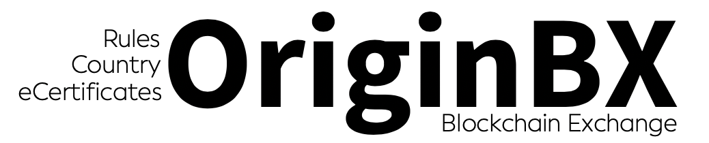

# Origin Blockchain Exchange OASIS Open Project Charter
________________

## 1. Project Name

### 1.1 Full Name
Origin Blockchain Exchange OASIS Open Project

### 1.2 Familiar Name
originbx-oasis

## 2. Abstract
The OriginBX OASIS Open Project is a neutral forum for diverse
stakeholders to create high-quality interoperable specifications for determining, obtaining, and verifying digital global tax and trade attestations (“GTTAs”).

Examples of GTTAs include:

- Certifications of origin for purposes of qualifying an imported good for preferential treatment under a free trade agreement;
- Compliance with a government’s procurement policies (e.g., US Buy America Act), or avoiding non-preferential origin retaliatory tariffs (e.g., Section 301 China Tariffs);
- Harmonized Tariff System (HTS) classifications;
- Export controls;
- Customs valuation;
- Numerous participating government agency admissibility certifications (e.g., declarations for goods made without Forced Labor);
- Intellectual property rights;
- Sustainability; and,
- Certifications of residency/tax residency certifications for global withholding tax compliance

## 3. Purpose and Scope
There are currently no universally acknowledged standards for the data requirements needed to support global tax and trade attestations. As a result, developers and systems engineers are either limited to a single suite of tools from a single vendor or must resort to costly manual import/export and data transform mechanisms to share information across systems.

The growth of small parcel vs. containerized shipments, as well as the introduction and growth of various blockchain and DLT platforms (Bitcoin, Ethereum, IBM TradeLens, etc.) each with their own unique protocols and specifications, is exacerbating an already massively inefficient administratively burdensome supply chain and regulatory compliance function.

The purpose of OriginBX is to provide governance over the creation of GTTA data standards, specifications, reference implementations and test suites that can enable private and governmental legacy tax and trade compliance systems and emerging DLT and network resources to interoperate successfully.

For trade, OriginBX plans to form sector-led technical subcommittees that will include automotive, technology, chemicals, life sciences, industrials, apparel, and footwear.

Subcommittees are also planned for global tax withholding residency certifications for investors, custodians, withholding agents, fund managers and tax authorities.

## 4. Business Benefits
Benefits of the OriginBX data standards will apply to all industries, all countries, and companies of all sizes.

For global trade, goods with multiple components, multiple layers of BOMs, and multiple locations and legal entities in the production process (referred to as “complex goods”) will achieve the most benefit. For withholding tax, cross-border dividends applying for tax treaty status will achieve the most
benefit.

Examples of benefits include:

- Fewer data hops between the data creator and requestor/receiver;
- Reduction in human effort involved in attaching source documents and schedules to emails or receiving emails with attachments of source documents and then downloading and uploading into their own
systems;
- Fewer human hours involved in reconciling data between disparate
systems;
- More efficient, less expensive, faster tax and trade software
implementations;
- Reduction in customizations on data interchange between systems;
- Fewer point-to-point interfaces between trading partners;
- Reduction in the administration and number of external users requiring access rights to internal systems;
- Higher rates of tax and customs compliance;
- More timely access to information for data analytics; and,
- Reduction in vendor lock-in.

Specific benefits for **global trade** standards include:

- **Global trade management software vendors and customs
brokerages** will be able to integrate into ERPs and other government agency systems using one common set of trade attestation data standards, which will greatly reduce the expense of engineering resources spent on system integrations. Resources previously spent on integrations can then be re-deployed to other parts of the product pipeline, enabling new development of higher value functionality.
- **Customs agencies** will benefit from an ability to verify product and trade attribute (i.e., HTS, origin, export controls, value, etc.) claims and audit immutable source records including product cost worksheets and technical specifications in near real time with trust and transparency.
- **SMEs and eCommerce merchants** will be able to accurately make
‘country of origin’ and ‘HTS duty rate’ claims for purposes of total landed cost, utilization of free trade agreements, customs compliance, and customer visibility.
- **Manufacturers, exporters, forwarders, and importers** will be able to more efficiently solicit and issue customs and trade attestations using their existing global trade management software.
- **Chambers of commerce, licensed customs brokers, trade
attorneys, and other trade compliance experts** will be able to
independently review, audit and attest to GTTA claims adding an
additional layer of trust.

Specific benefits for **global withholding tax** standards:

- **Tax agencies** will benefit from an ability to fully reconcile each dividend event. In addition, they will be able to  instantaneously verify the tax residency status of securities holders. Tax agencies will also benefit by reducing fraud risk (see [$62.9 billion CUM-Ex Scandal](https://en.wikipedia.org/wiki/CumEx-Files) ).
- **Custodians** will benefit from automation resulting in significant administrative efficiency gains. Custodians will also be able to offer greater customer service by increasing the visibility of the WHT status as well as improving the cash flow position of their customers through appropriate reductions in WHT.
- **Investors** will benefit from an increase in return on investment from a reduction in WHT and reductions in tax professional engagement fees from fewer WHT refund claims.
- **Fund Managers** will benefit by being able to show investors that they are able to claim WHT treaty benefits at source, rather than a more lengthy and costly reclaim process.

## 5. Relationship to Other Projects
There are several active and important standards-based initiatives aimed at global tax and trade data standards, interoperability, and facilitation. Most of these initiatives are focused on the supply chain itself or trade finance, rather than the GTTAs necessary for cross border tax and customs compliance.

Examples include:

(NOTE: THERE ARE MANY MORE REGIONAL INITIATIVES DRIVEN OUT OF THE EU AND ASIA)

- **UN/EDIFACT**: The OriginBX data standards project intends to
leverage and augment various EDIFACT data elements and segments
to also include GTTAs, which currently lack sufficient specificity.
- **World Customs Organization’s WCO Data Model**: The OriginBX
data standards project intends to leverage and augment various data elements and concepts specifically related to a good’s trade attributes (e.g., HTS, origin, export controls, value, etc.), rather than physical movements.
- **GS1.org/EAN/UNSPSC**: The OriginBX data standards project intends to link UPCs such as the GTIN to the GTTAs and then make the GTTAs accessible and interoperable amongst legacy and DLT
platforms.
- **OASIS BASELINE and Nightfall**: Intention is to apply DLT and the public ETH mainnet to GTTAs.
- **Belt and Road** (https://www.cfr.org/backgrounder/chinas-massive-belt-and-road-initiative) : Intention is to ensure OriginBX GTTA data standards are adopted by this initiative.
- **W3C Verified Credentials Data Model** (https://www.w3.org/TR/did-core/) and **Digital Identifiers** (https://www.w3.org/TR/did-core/). Intention is to adopt these open standards for GTTA creators, attestors, and underlying products.
- **Global Alliance for Trade Facilitation**
(https://www.tradefacilitation.org/country-projects/?fwp_paged=2):
Work with World Economic Forum, governments, donors and sponsors
on the GATF’s country of origin blockchain pilot for purposes of
adopting GTTA data standards.
- **International Chamber of Commerce/World Chambers Federation**
(https://certificates.iccwbo.org): Integrate GTTA standards into
ICC/WBO platform for enhanced interoperability.
- **US Customs and Border Protection/Department of Homeland
Security**: Working on several open standards and blockchain pilots
involving GTTAs for country of origin and intellectual property rights. GTTA standards should be factored into CBPs planning.
- **MediLedger** (https://www.mediledger.com/fda-pilot-project): FDA pilot addressing 2023 requirements of the Drug Supply Chain Security Act (DSCSA), and should integrate GTTA’s in regards to country of origin for both preferential and non-preferential origin (i.e., Buy America and EO on Ensuring Essential Medicines are Made in the USA).
- **Commercial Customs Operations Advisory Committee ([COAC](https://www.cbp.gov/trade/stakeholder-engagement/coac/coac-subcommittees) ) /
USCBP Committee on Next Generation and Facilitation**: Addressing data elements and standards for GTTA facilitation and “Trusted Traders” generally.
- **Automobile Industry Action Group (AIAG)** (https://www.aiag.org/about): Has a committee consisting of over 20 OEMs and Parts suppliers discussing USMCA data standards specific to the auto industry for country of origin.
- **[OriginTrail](https://origintrail.io/)**: An EU-based non-profit foundation addressing country of origin using smart contracts and tokens.

## 6. Repositories and Licenses
The project expects to launch with one repository for development of the initial code. The repository will be under the CC BY 4.0 open-source license.

Attribution 4.0 International (CC BY 4.0) (https://creativecommons.org/licenses/by/4.0/legalcode)

## 7. Initial Contributions from Existing Work

## 8. Project Leadership

### 8.1 Project Governing Board

Per OASIS Open Project Rules, each OriginBX Sponsor organization may hold one voting seat on the PGB. The PGB will also include a member of the Technical Steering Committee. Initial OriginBX OASIS PGB members are expected to include: 

- Todd R. Smith, Retired Global Trade Big 4 Principal; OriginBX founding board member; KYG Trade, LLC founder CEO.
- Patrick D. O'Meara, Founder &amp; CEO Inveniam.IO a fintech firm. Advisor or principal in $3b in debt and ~$2b in equity transactions.

### 8.2  Sponsors

Initial Sponsors include:

- Accenture - https://www.accenture.com/us-en
- CompTIA - https://www.comptia.org/home
- Global Trade Professionals Alliance (GTPA) - https://www.gtpalliance.com/
- Inveniam Capital Partners - https://inveniam.io/
- KYG Trade, LLC
- Origin Experts Group - https://www.originexpertsgroup.com/
- Thompson Reuters - https://www.thomsonreuters.com/en.html

### 8.3 Other Contributors 
Initial technical contributors include:

- James Roberts, Retired Advisory Big 4 Principal and OriginBX TM
Foundation Managing Director (Australia)
- Kevin Cuddeback, Data Scientist, Inveniam.IO. Leading roles at
several data and SaaS firms. Innovation consultant.
