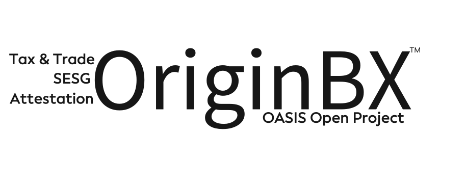

# Getting Started as an Open Project Sponsor

All organizations are welcome to support the Origin Blockchain Exchange (OriginBX) OASIS Open Project. If you want to become a sponsor, or if you haven’t sent in your OCA Sponsor Agreement yet, [contact OASIS for help on that](mailto:communications@oasis-open.org).

Here are some ways to ensure you get the most out of your sponsorship.

## Get your logo added to the OriginBX website (originbx-oasis.org)
[Send us](member-services@oasis-open.org) your logo image, along with an associated URL. (A stacked or square version works better than horizontal.)  

## Be represented on the OriginBX Project Governing Board (PGB)
Every OriginBX sponsor has the option to be represented on the project's PGB. General PGB responsibilities are described [here](https://github.com/oasis-open-projects/documentation/blob/master/guides/getting-started-guide.md#identifying-roles).

To be on the PGB, your organization will need to sign our [Entity Contributor License Agreement (e-CLA)](https://www-legacy.oasis-open.org/resources/projects/cla/projects-entity-cla) and your representative will need to sign our Individual Contributor Licsnse Agreement (i-CLA).  Once you submit the CLAs, let the [OASIS Project Administrator](mailto:project-admin@oasis-open.org) know who your rep will be, and we’ll add them to the PGB roster, email group, and any other active forums.

Your representative will be subscribed to the PGB mailing list automatically. Other people from your organization may sign up as observers.

Information on upcoming calls will usually be posted on the PGB calendar.

## Maximize your marketing benefits.
If your project has a marketing working group or a marketing/outreach channel on Slack, encourage your marketing, PR, and events staff to join. Once this working group is up and running, you should have at least one representative subscribed to the email group, attending the monthly calls, and helping out with ideas, blog posts and more.

## GitHub
The OASIS Open Projects Manager will send a direct invitation to your PGB rep to join the originbx-oasis project on GitHub. Everyone is encouraged to follow along with the work by watching the project's repositories...and, of course, by contributing pull requests and issues!

Welcome aboard!
