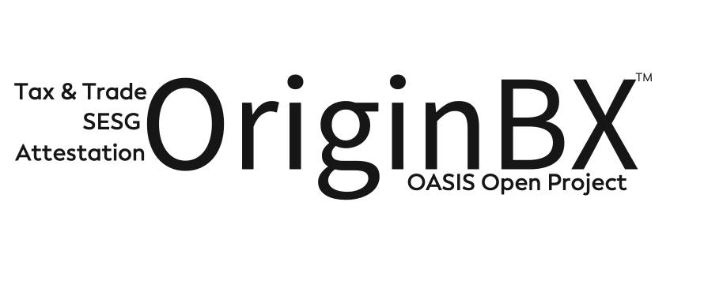

# Sponsors of OriginBX OASIS Open Project

OASIS Open and the OriginBX community thank the following organizations who generously support the work, funding the development of the interoperability standards and open source tools that their organizations and customers depend on. Starred organizations have taken the additional step of signing the enterprise contributor license agreement and seating a representative on the Project Governing Board. 

- [Accenture](https://www.accenture.com/us-en) &bigstar; 
- [Amazon](https://www.amazon.com/) &bigstar;
- [CompTIA](https://www.comptia.org/home) &bigstar; 
- [GS1](https://www.gs1.org/)
- [IBM](https://www.ibm.com)
- [International Chamber of Commerce (ICC)](https://iccwbo.org/) &bigstar;
- [Intel](https://www.intel.com/) &bigstar;
- [Inveniam Capital Partners](https://inveniam.io/)
- [KYG Trade, LLC](https://www.kyg.trade/) &bigstar; 
- [MonetaGo](https://www.monetago.com/) &bigstar;
- [Origin Experts Group](https://www.originexpertsgroup.com/) &bigstar;
- [Pinary](https://pinaryinc.com/home/) &bigstar;
- [Skuchain](https://www.skuchain.com/) &bigstar;
- [United Parcel Service (UPS)](https://www.ups.com/) &bigstar;

